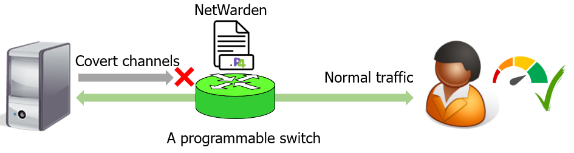

# NetWarden: Mitigating Network Covert Channels while Preserving Performance

## Introudction

Network covert channels are an advanced class of security threats, in which an attacker can exfiltrate secret information  via channels that are not intended for carrying data. Two typical classes of network covert channels are timing channels and storage channels. The former leak data by modulating packet timing, e.g., using the large inter packet delay to encode 1 and the small one to encode 0. The latter embed data inside packet headers, e.g., using IPID of the IPv4 header to encode data.
The state-of-the-art mitigations handle covert channels with connection performance sacrifice, because most of them are software solutions that cannot handle the volume and velocity of data plane traffic. Besides, the mitigation itself could incur performance penalty. For example, one effective way to mitigate timing channels is to add random delays, but it will enlarge RTTs of the connection, causing decrease of connection throughput.

We have proposed NetWarden which can mitigate covert channel effectively while *preserving performance*. As shown in the following figure, NetWarden locates in the middle between the protected server and the user. It works as a TCP proxy, but the major duty of it is to mitigate covert channels. It checks all passing through traffic to detect and mitigate covert channels in real time. More importantly, NetWarden does not hurt TCP performance by using our performance boosting techniques. More details can be found here:
[NetWarden (USENIX Security'20)](https://jxing.me/pdf/netwarden-sec20.pdf).


<p align="center">
  
</p>


## Citing
If you feel our paper and code is helpful, please consider citing our paper by:
```
@inproceedings{xing2020netwarden,
  title={NetWarden: Mitigating Network Covert Channels while Preserving Performance},
  author={Xing, Jiarong and Kang, Qiao and Chen, Ang},
  booktitle={29th USENIX Security Symposium (USENIX Security'20)},
  year={2020}
}
```

## Contact
If you have any questions about of design and the code, please contact the author:
```
Jiarong Xing (jxing@rice.edu)
Qiao Kang (qiaokang@rice.edu)
```

## License
The code is released under the [GNU Affero General Public License v3](https://www.gnu.org/licenses/agpl-3.0.html).


